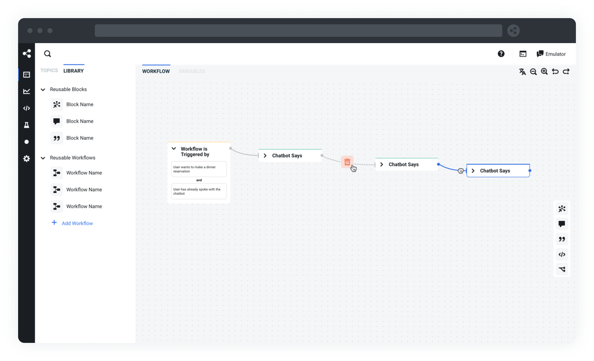

# Botpress

## What is Botpress?

Botpress is the standard developer stack to build, run and improve Conversational-AI applications. Powered by natural language understanding, a messaging API, and a fully-featured studio, Botpress allows developers around the globe to build remarkable chatbots without compromise.

**Botpress includes:**

- Administration panel to orchestrate and monitor your chatbots
- Conversation Studio to design a conversation, manage content, code custom integration
- Easy integration with messaging channels (Messenger, WhatsApp, Slack, Teams, Webchat, Telegram, SMS & more)
- Natural Language Understanding. 
- Complete list of features and specs [here](https://botpress.com/docs/features)

## Getting Started

1. Download the latest binary for your OS [here](https://botpress.com/download?utm_source=github&utm_medium=organic&utm_campaign=botpress_repo&utm_term=readme)
2. Once downloaded follow the link as per your OS: [Linux](https://www.youtube.com/watch?v=89RJx0kQyKM), [Windows](https://www.youtube.com/watch?v=xf246NQyMj4), [Mac OS](https://www.youtube.com/watch?v=SBv0QOXyHL4).

## Hosting or Deploying on enviroment
* [Deploying on Ubuntu server](./ubuntu-installation.md)
* [Deploying using Docker](./docker-installation.md)